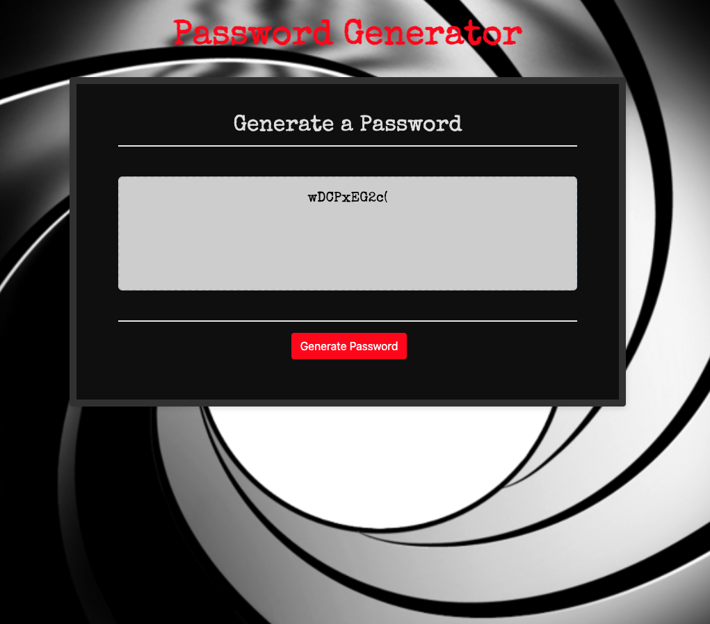

# hw3PasswordGenerator
JS Password Generator using DOM Manipulation to add design to page

## The Assignment

- Create an application that generates a random password based on user's criteria preferences.

# Requirements include:

- When prompted, the User must choose
A password length from 8 to 128
And a preference for characters to include in the password including upper and lowercase letters, numbers, and special characters.

- Application should perform validate that password length is valid and that user has chosen at least one character set to include in the generated password.

- Application must be styled from the JS file.

# Submitted App

  https://github.com/jenneration/hw3PasswordGenerator
  
  https://jenneration.github.io/hw3PasswordGenerator/

